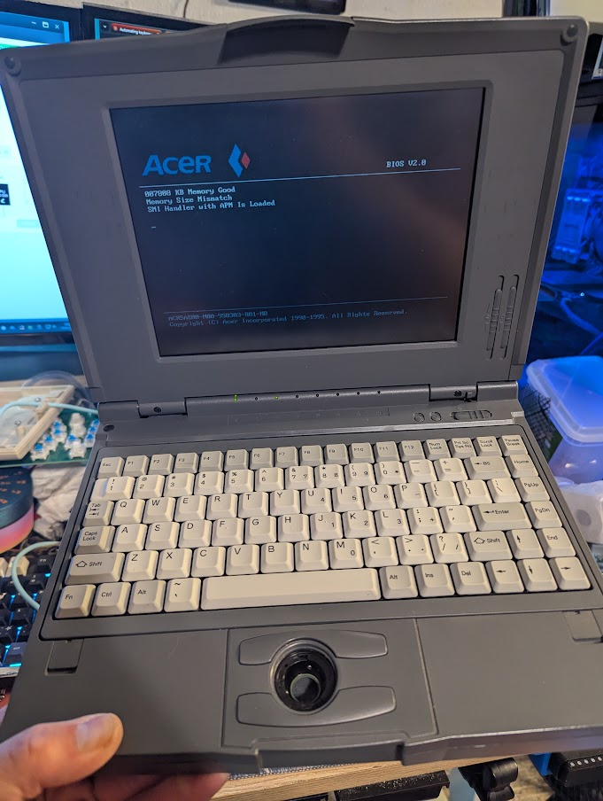
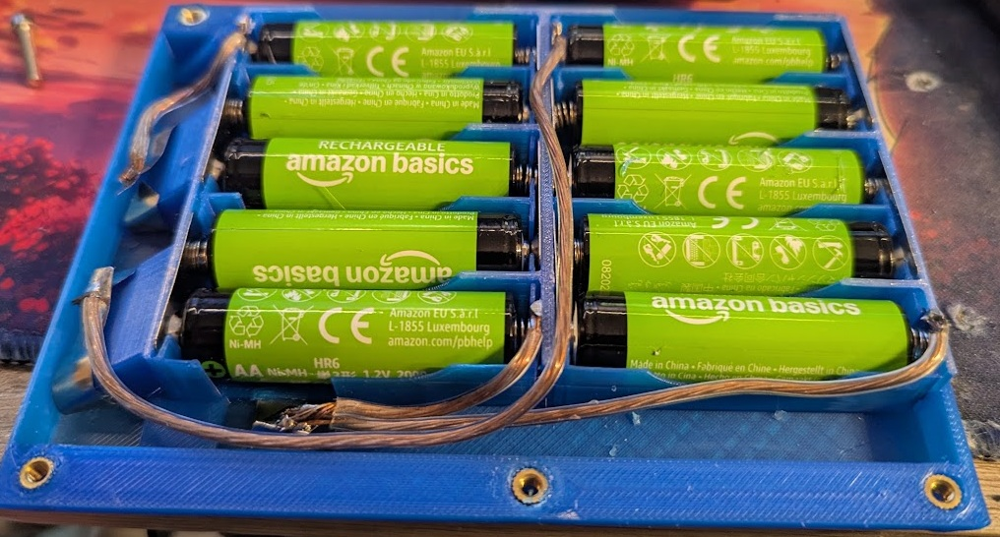
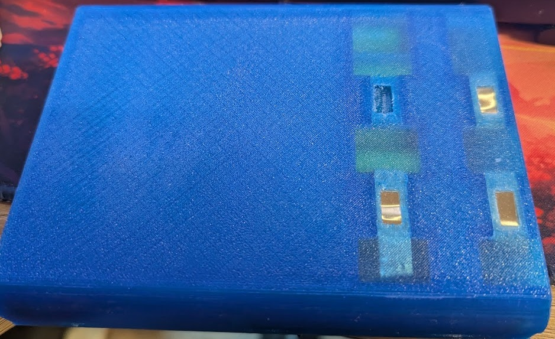
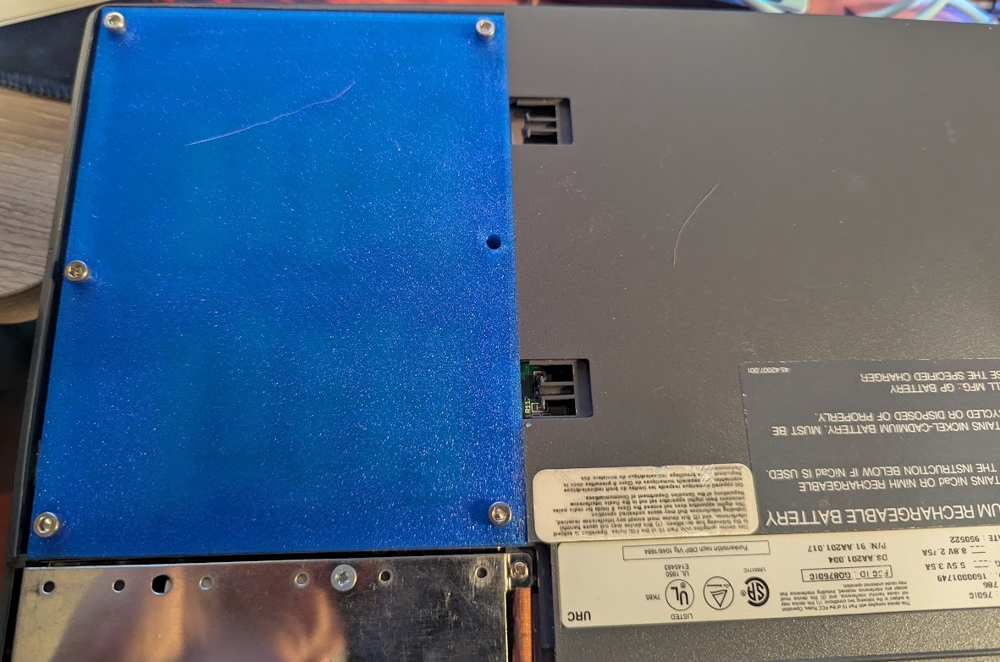

# AcerNote 760iC Battery Pack Rebuild

Rebuilding the dead battery pack for the Acer AcerNote 760iC so it accepts standard, replaceable **AA cells**. The original cells are long gone, and the teardown damaged the case so a new shell had to be made: AA contact tabs go in the cell slots, nickel strips underneath form the interconnects, and everything is wired back to the original output pad layout.

## Specs

| | |
|---|---|
| Chemistry | NiMH |
| Cells | 10 × AA, 2000 mAh |
| Configuration | 2 series strings of 5 cells |
| Per string | 6.0 V nominal (5 × 1.2 V), 2000 mAh |
| Output pads | Two 6.0 V positive taps sharing a common negative |
| In use | Taps run in parallel — 6.0 V, 4000 mAh |

A 5-cell NiMH string reads ~6.0 V nominal and ~7.0–7.25 V right off the charger. The laptop runs the two positive taps in parallel when powering, giving 6.0 V at 4000 mAh; the separate taps most likely let the charger monitor and balance the two strings independently.

## What this is

The pack carries **two series strings of 5 AA cells**. Contact tabs in the cell slots let you drop in normal AA cells instead of a soldered-in pack, and nickel strips underneath tie the cells into the two strings and route them out to the output pads.

## Materials

- **AA battery contact tabs/springs** — one per cell slot (similar to https://a.co/d/01AbI9zu)
- **Nickel strips** — the kind used for spot-welding battery packs (similar to https://a.co/d/0gudx9yP)
- **M3 heat-set threaded inserts**
- **M3 screws**
- Soldering iron (for tabs and strips)

## Build

### 1. Install the AA contact tabs

Fit a contact tab into each cell slot so the AA cells make contact at both ends.

### 2. Run the nickel strips underneath

The holes on the underside are where the nickel strips route. Use them to link the cells into **two series strings of 5**, and to carry each string out to the output pads. The strips solder to the tabs.

### 3. Wire to the output pads

Pad layout, viewed from the **bottom** of the battery:

| Pad (bottom view) | Connection |
|---|---|
| Top two pads | **Positive** — each goes to the positive end of one of the two 5-cell strings |
| Middle | **Temperature sensor** — not used in this build (left unconnected) |
| Right | **Negative** — the negative ends of both strings tied together |

> Double-check polarity against the table above before installing the pack in the laptop.

### 4. Close it up

The bottom half takes **M3 heat-set threaded inserts**. Melt the inserts in, then screw the top and bottom halves together with **M3 screws**.

## Photos

| File | Shows |
|---|---|
| `Images/batinside.jpg` | Cells and contact tabs installed |
| `Images/batbottom.jpg` | Underside — output pads and nickel-strip wiring |
| `Images/batinstalled.jpg` | Pack installed in the AcerNote |
| `Images/laptopworking.jpg` | 760iC running on the rebuilt pack |
